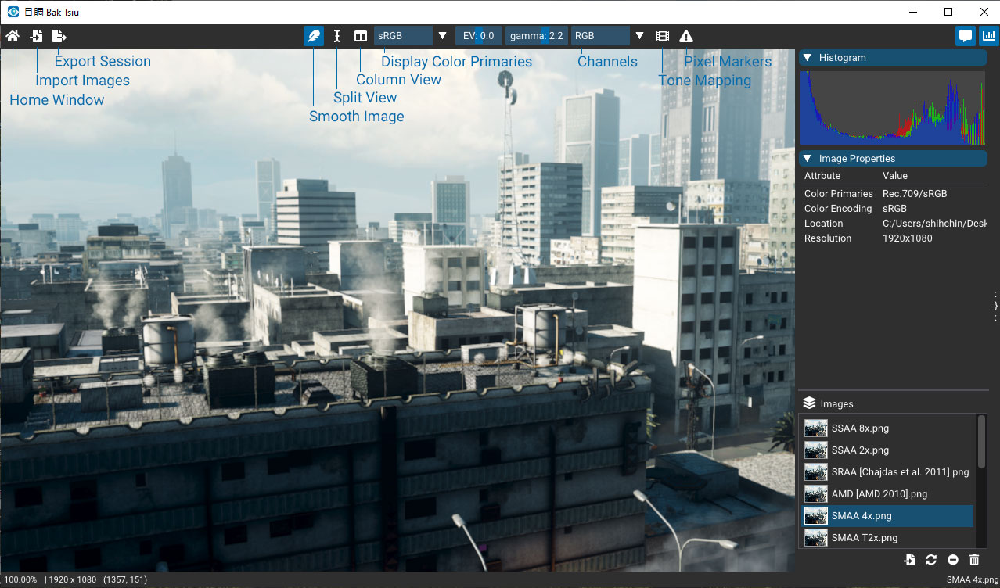
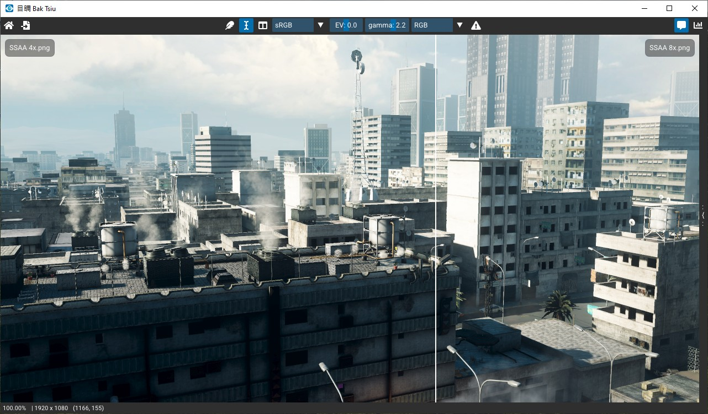
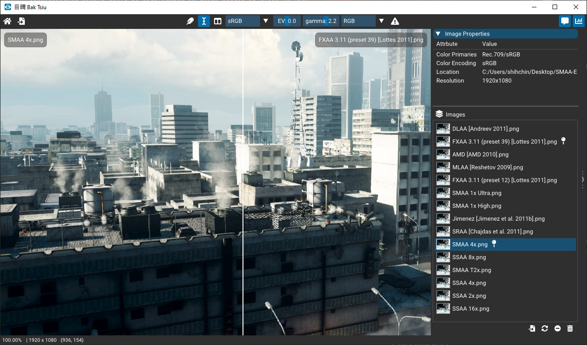
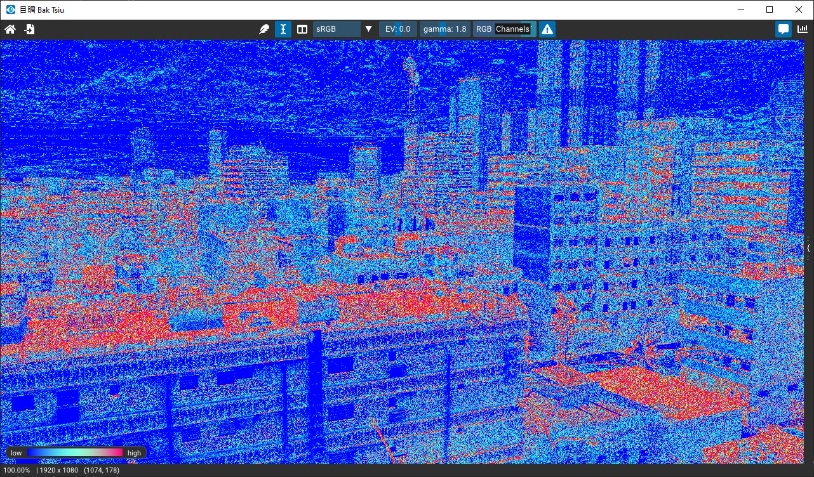
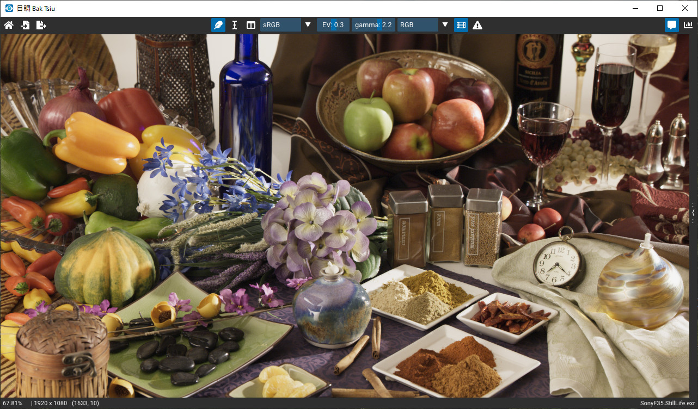

<link rel="stylesheet" href="https://pro.fontawesome.com/releases/v5.10.0/css/all.css" integrity="sha384-AYmEC3Yw5cVb3ZcuHtOA93w35dYTsvhLPVnYs9eStHfGJvOvKxVfELGroGkvsg+p" crossorigin="anonymous"/>

# Bak-Tsiu Quickstart Guide

When comparing render results from different anti-aliasing or importance sampling algorithms, I found there are no convenient tools for examining pixel differences among multiple images. Bak-Tsiu is created to meet the needs of fast pixel navigation, it's a tool derived from my personal workflow. If you are looking for a tool to compare several similar images. Hope Bak-Tsiu would be also a helpful tool for you.

> The sample images used in the following figures are downloaded from the [supplementary material](http://www.iryoku.com/smaa/) of *SMAA: Enhanced Subpixel Morphological Antialiasing*, Jimenez et al., 2012.

## Basic Navigation

* Pan View: drag left mouse button
* Zoom In/Out: <kbd>+</kbd>/<kbd>-</kbd> or scroll mouse wheel
* Continuous Zooming: drag left and right mouse buttons vertically
* Zoom to Actual Size: <kbd>F</kbd>
* Fit Image to Viewport: <kbd>Shift+F</kbd>
* Pixel Sniper: holding <kbd>Z</kbd>

> The RGB values shown in close-up view are in **linear encoded ACES AP1** color space. The values would be affected by any stage before output device transformation. For more information about the color processing pipeline, please refer to this introductory [blog post](https://blog.frame.io/2019/09/09/aces/) about the Academy Color Encoding System ([ACES](https://github.com/ampas/aces-dev)).

## Image Comparison Slider <i class="fas fa-i-cursor"></i>

Press <kbd>S</kbd> or <i class="fas fa-i-cursor"></i> button to toggle split view.

## Side-by-Side Navigation <i class="fas fa-columns"></i>

Press <kbd>C</kbd> or <i class="fas fa-columns"></i> button to toggle side-by-side view for pixel navigation. 

The corresponding pixels would be highlighted in green border in close-up view. If there is no highlighted border shown in another view, please move the splitter to make more space and pan the view to the region of interests.

To apply local translation to current column view, just press <kbd>Alt</kbd> and drag left mouse button. If you want to synchronize local translation of both views, press <kbd>Alt+C</kbd>.

## Image Layers <i class="fas fa-layer-group"></i>

Press <kbd>Tab</kbd> key or click <i class="fas fa-chart-bar"></i> button to toggle property window. Click left mouse button on the image item to display it on the left; click right mouse button for the displayed image on the right.

To switch the image on the right, press
* <kbd>D</kbd> or <kbd>&rarr;</kbd> to next image in the list 
* <kbd>A</kbd> or <kbd>&larr;</kbd> to previous image in the list
* <kbd>X</kbd> or <kbd>&uarr;</kbd> to exchange left and right images

The basic image screening idea is to **put the image you like better on the left**, one recommended workflow is:

1. Drop all images into viewport or click <i class="fas fa-file-import"></i> to import images
2. Open image layers <i class="fas fa-chart-bar"></i> and select the first two images
3. If the right image is better than the left one, press <kbd>X</kbd> or <kbd>&uarr;</kbd> to exchange them
4. Press <kbd>D</kbd> or <kbd>&rarr;</kbd> to put next candidate on the right
5. Back to step 3 until the last image is shown

> For blind test, just toggle <i class="fas fa-comment-alt"></i> button at top-right corner to hide image names in viewport.

## Pixel Warning Markers <i class="fas fa-exclamation-triangle"></i>

Pixel warning markers are used to highlight problematic pixels. The option menu is invoked via right mouse click on <i class="fas fa-exclamation-triangle"></i> button.

Color difference of two corresponding pixels are computed in [Lab color space](https://en.wikipedia.org/wiki/CIELAB_color_space). There are two visualization options:

* Difference: highlight different pixels with magenta color

* Diff as Heatmap: map color distance to a color ramp (from blue to magenta)

Range clipping detection (not shown in heatmap mode):

* Shadow clipping (blue mark): if all RGB values < 0.00001
* Highlight clipping (red mark): if all RGB values > 1.0

## Tone Mapping <i class="fas fa-film"></i>

Numerical [approximation](https://github.com/shihchinw/numex/blob/master/notebooks/aces_color_transform.ipynb) of ACES tone mapping.

## Controls

|To do this|Press|
|-|-|
| Show Home Window | <kbd>F1</kbd> |
| Toggle Property Window | <kbd>Tab</kbd> |
| Toggle Split View | <kbd>S</kbd> |
| Toggle Side-by-Side Column View | <kbd>C</kbd> |
| Toggle Pixel Warning Markers | <kbd>W</kbd> |
| Toggle Linear Image Filter | <kbd>Q</kbd> |
| **Files** |
| Import Images | <kbd>Ctrl+O</kbd> |
| Export Session | <kbd>Ctrl+E</kbd> |
| Reload Selected Image | <kbd>F5</kbd> |
| Close Selected Image | <kbd>Backspace</kbd> or <kbd>Del</kbd> |
| Close All Images | <kbd>Ctrl+Shift+W</kbd> |
| **Pixel Navigation** |
| Pan View | Drag Left Mouse Button |
| Offset Column View | Drag Left Mouse Button + <kbd>Alt</kbd> |
| Zoom In/Out | Scroll Mouse or Drag Left + Right Mouse Buttons Vertically |
| Zoom In/Out in Power-of-Two | <kbd>+</kbd> / <kbd>-</kbd> |
| Zoom to Actual Size | <kbd>/</kbd> or <kbd>F</kbd> |
| Fit to Viewport | <kbd>Shift+F</kbd> |
| Sync Column Views | <kbd>Alt+C</kbd> |
| Pixel Sniper | Holding <kbd>Z</kbd> |
| **Image Selection** |
| Next Compared Image | <kbd>D</kbd> or <kbd>&rarr;</kbd> |
| Previous Compared Image | <kbd>A</kbd> or <kbd>&larr;</kbd> |
| Exchange Compared Images | <kbd>X</kbd> or <kbd>&uarr;</kbd> |
| Set Left Compared Image | Click Left Mouse Button on the Image Item |
| Set Right Compared Image | Click Right Mouse Button on the Image Item |

## Supported Image Formats

* BMP
* GIF
* HDR
* JPG
* OpenEXR
* PNG